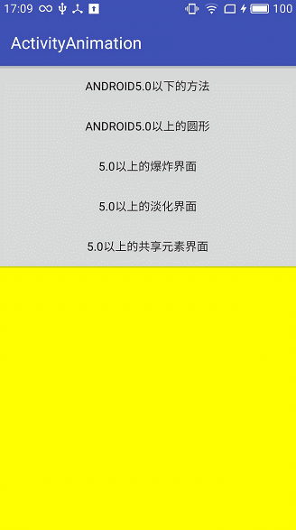

# Android5.0 Activity的跳转动画
### 一、首先介绍5.0一下的跳转动画，在res下面创建“anim”的包，新建两个xml文件，分别命名为`screen_zoom_in.xml`和`screen_zoom_out.xml`
`screen_zoom_in.xml`

    <?xml version="1.0" encoding="utf-8"?>
    <set xmlns:android="http://schemas.android.com/apk/res/android"
    	android:duration="300"
    >
	    <scale
		    android:fromXScale="1.4"
		    android:fromYScale="1.4"
		    android:toXScale="1.0"
		    android:toYScale="1.0"
		    android:pivotX="40%p"
		    android:pivotY="40%p"
	    />
	    
	    <alpha
		    android:fromAlpha="0"
		    android:toAlpha="1"
	    />
    </set>

`screen_zoom_out.xml`

    <?xml version="1.0" encoding="utf-8"?>
    <set xmlns:android="http://schemas.android.com/apk/res/android"
    	android:duration="300"
    >
    
	    <scale
		    android:fromXScale="1.0"
		    android:fromYScale="1.0"
		    android:toXScale="1.4"
		    android:toYScale="1.4"
		    android:pivotX="40%p"
		    android:pivotY="40%p"
	    />
	    
	    <alpha
		    android:fromAlpha="0"
		    android:toAlpha="1"
	    />
    </set>
### 跳转代码为：
    Intent intent1 = new Intent(this, CommonActivity.class);
    startActivity(intent1);
    overridePendingTransition(R.anim.screen_zoom_in,R.anim.screen_zoom_out);

### 如下图所示：
