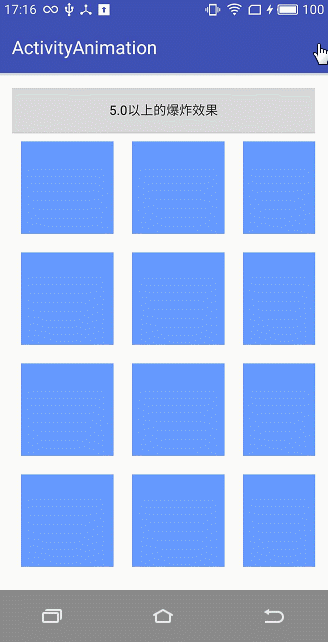

# Android5.0 Activity的跳转动画
### 一、首先介绍5.0以下的跳转动画，在res下面创建“anim”的包，新建两个xml文件，分别命名为`screen_zoom_in.xml`和`screen_zoom_out.xml`，这是由大变小的动画。
`screen_zoom_in.xml`

    <?xml version="1.0" encoding="utf-8"?>
    <set xmlns:android="http://schemas.android.com/apk/res/android"
    	android:duration="300"
    >
	    <scale
		    android:fromXScale="1.4"
		    android:fromYScale="1.4"
		    android:toXScale="1.0"
		    android:toYScale="1.0"
		    android:pivotX="40%p"
		    android:pivotY="40%p"
	    />
	    
	    <alpha
		    android:fromAlpha="0"
		    android:toAlpha="1"
	    />
    </set>

`screen_zoom_out.xml`

    <?xml version="1.0" encoding="utf-8"?>
    <set xmlns:android="http://schemas.android.com/apk/res/android"
    	android:duration="300"
    >
    
	    <scale
		    android:fromXScale="1.0"
		    android:fromYScale="1.0"
		    android:toXScale="1.4"
		    android:toYScale="1.4"
		    android:pivotX="40%p"
		    android:pivotY="40%p"
	    />
	    
	    <alpha
		    android:fromAlpha="0"
		    android:toAlpha="1"
	    />
    </set>
### 跳转代码为：
    Intent intent1 = new Intent(this, CommonActivity.class);
    startActivity(intent1);
    overridePendingTransition(R.anim.screen_zoom_in,R.anim.screen_zoom_out);

### 如下图所示：

### 二、Android5.0以上的圆形动画，采用编码的形式。
      secondView.setVisibility(View.VISIBLE);
    // Activity设置自定义 Shared Element切换动画
	if (Build.VERSION.SDK_INT >= Build.VERSION_CODES.LOLLIPOP) {
	    int centerX = (v.getLeft() + v.getRight()) / 2;
	    int centerY = (v.getTop() + v.getBottom()) / 2;
	    float finalRadius = (float) Math.hypot((double) centerX, (double) centerY);
	    Animator mCircularReveal = ViewAnimationUtils.createCircularReveal(
	    secondView, centerX, centerY, 0, finalRadius);
	    
	    mCircularReveal.setDuration(400).start();
    }
###如下图所示：

### 三、Android5.0以上的爆炸效果，首先，要在`res`下的创建`transition`文件夹，注意名字一定是`transition`，不能放在`anim`包下，新建一个`explode.xml`文件。
    <?xml version="1.0" encoding="utf-8"?>
    <explode xmlns:android="http://schemas.android.com/apk/res/android"
    	android:duration="300"
    >
    </explode>	
### 跳转代码。

     if (Build.VERSION.SDK_INT >= Build.VERSION_CODES.LOLLIPOP) {
	    Transition explode = TransitionInflater.from(this).inflateTransition(R.transition.explode);
	    //退出时使用
	    getWindow().setExitTransition(explode);
	    //第一次进入时使用
	    getWindow().setEnterTransition(explode);
	    //再次进入时使用
	    getWindow().setReenterTransition(explode);
    }
    Intent intent2 = new Intent(this, CommonActivity.class);
    startActivity(intent2, ActivityOptionsCompat.makeSceneTransitionAnimation(this).toBundle());
### 如下图所示：

### 四、Android5.0以上的淡化效果，首先，要在`res`下的创建`transition`文件夹，注意名字一定是`transition`，不能放在`anim`包下，新建一个`fade.xml`文件。
    <?xml version="1.0" encoding="utf-8"?>
    <fade xmlns:android="http://schemas.android.com/apk/res/android"
    	android:duration="300"
    >
    </fade>
### 跳转代码
    if (Build.VERSION.SDK_INT >= Build.VERSION_CODES.LOLLIPOP) {
	    Transition fade = TransitionInflater.from(this).inflateTransition(R.transition.fade);
	    //退出时使用
	    getWindow().setExitTransition(fade);
	    //第一次进入时使用
	    getWindow().setEnterTransition(fade);
	    //再次进入时使用
	    getWindow().setReenterTransition(fade);
    }
    Intent intent = new Intent(this, CommonActivity.class);
    startActivity(intent, ActivityOptionsCompat.makeSceneTransitionAnimation(this).toBundle());
### 效果如图：

### 五、Android5.0的元素共享效果。
#### 5.1 共享一个资源效果，在第一个activity的布局文件中，元素的 android:transitionName="sharedBlue"，要跟下一个跳转的activity布局中共享元素的名字一样。
     <View
    android:id="@+id/share_blue"
    android:layout_width="100dp"
    android:layout_height="100dp"
    android:layout_margin="10dp"
    android:background="#6699ff"
    android:transitionName="sharedBlue"
    android:layout_gravity="right"
    />

    <View
	    android:id="@+id/share_yellow"
	    android:layout_width="100dp"
	    android:layout_height="100dp"
	    android:layout_margin="10dp"
	    android:background="#ffff00"
	    android:transitionName="sharedYellow"
    />
####下一个activity布局中元素
    <View
    	android:id="@+id/share_blue"
    	android:layout_width="200dp"
    	android:layout_height="200dp"
    	android:layout_margin="10dp"
    	android:background="#6699ff"
    	android:transitionName="sharedBlue"
    	
    	android:layout_alignParentBottom="true"
    />

     <View
	    android:id="@+id/share_yellow"
	    android:layout_alignParentRight="true"
	    android:layout_width="200dp"
	    android:layout_height="200dp"
	    android:layout_margin="10dp"
	    android:background="#ffff00"
	    android:transitionName="sharedYellow"
    />
#### 跳转代码
    Intent intent1 = new Intent(ShareActivity.this, BlueActivity.class);
    startActivity(intent1, ActivityOptionsCompat.makeSceneTransitionAnimation(ShareActivity.this, share_blue, "sharedBlue").toBundle());
#### 动画效果

#### 5.2 Android5.0共享两个元素，布局参考5.1，跳转代码：
     Pair first = new Pair<>(share_blue, ViewCompat.getTransitionName(share_blue));
    
    Pair second = new Pair<>(share_yellow, ViewCompat.getTransitionName(share_yellow));
    ActivityOptionsCompat transitionActivityOptions =
    ActivityOptionsCompat.makeSceneTransitionAnimation(ShareActivity.this, first, second);
    Intent intent2 = new Intent(ShareActivity.this, BlueActivity.class);
    ActivityCompat.startActivity(ShareActivity.this,
    intent2, transitionActivityOptions.toBundle());
#### 动画效果：

#### 5.3 Android5.0自定义共享元素的动画效果，首先写一个自定义动画的Java文件，`CustomChangeBounds.java`，
    public class CustomChangeBounds extends ChangeBounds {
    
	    @Override
	    public Animator createAnimator(final ViewGroup sceneRoot,
	       TransitionValues startValues,
	       final TransitionValues endValues) {
	    
		    Animator changeBounds = super.createAnimator(sceneRoot, startValues, endValues);
		    if (startValues == null || endValues == null || changeBounds == null)
		    	return null;
		    
		    changeBounds.setDuration(300);
		    changeBounds.setInterpolator(AnimationUtils.loadInterpolator(sceneRoot.getContext(),
		    android.R.interpolator.fast_out_slow_in));
		    return changeBounds;
	    }
    
    }
#### 在第二个activity中，
	//布局
     <View
	    android:id="@+id/share_blue"
	    android:layout_width="200dp"
	    android:layout_height="200dp"
	    android:layout_margin="10dp"
	    android:background="#6699ff"
	    android:transitionName="transition_morph_view"
	    android:layout_gravity="right"
	    android:layout_centerInParent="true"
    />
	//代码
    share_blue = findViewById(R.id.share_blue);
    // Activity设置自定义 Shared Element切换动画
    if (Build.VERSION.SDK_INT >= Build.VERSION_CODES.LOLLIPOP) {
	    //定义ArcMotion
	    ArcMotion arcMotion = new ArcMotion();
	    arcMotion.setMinimumHorizontalAngle(50f);
	    arcMotion.setMinimumVerticalAngle(50f);
	    
	    //插值器，控制速度
	    Interpolator interpolator = AnimationUtils.loadInterpolator(this, android.R.interpolator.fast_out_slow_in);
	    
	    //实例化自定义的ChangeBounds
	    CustomChangeBounds changeBounds = new CustomChangeBounds();
	    
	    changeBounds.setPathMotion(arcMotion);
	    changeBounds.setInterpolator(interpolator);
	    changeBounds.addTarget(share_blue);
	    
	    //将切换动画应用到当前的Activity的进入和返回
	    getWindow().setSharedElementEnterTransition(changeBounds);
	    getWindow().setSharedElementReturnTransition(changeBounds);
    }
#### 第一个activity的跳转代码
     Intent intent = new Intent(this, CustomShareActivity.class);
    ActivityOptionsCompat options = ActivityOptionsCompat.makeSceneTransitionAnimation
    (ShareActivity.this, share_blue, "transition_morph_view");
    startActivity(intent, options.toBundle());
#### 动画效果

